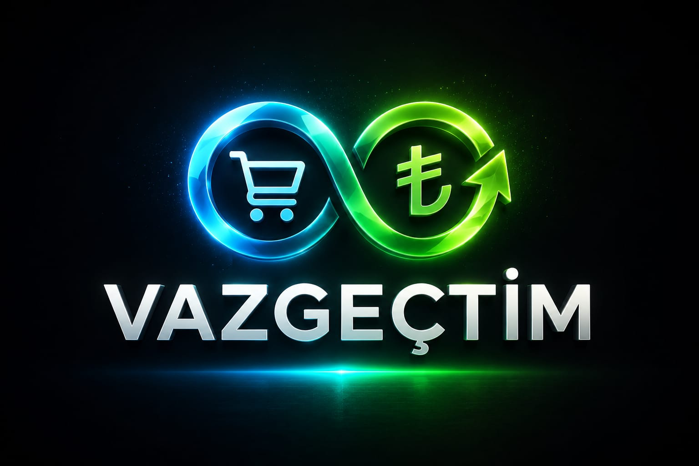
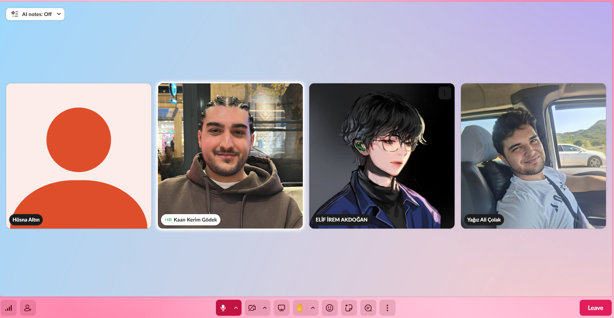
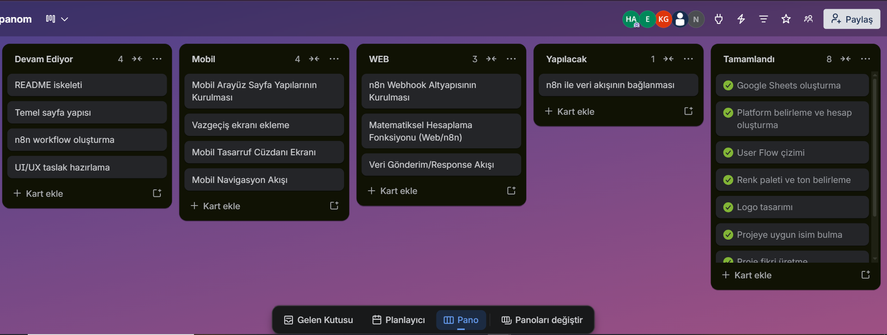
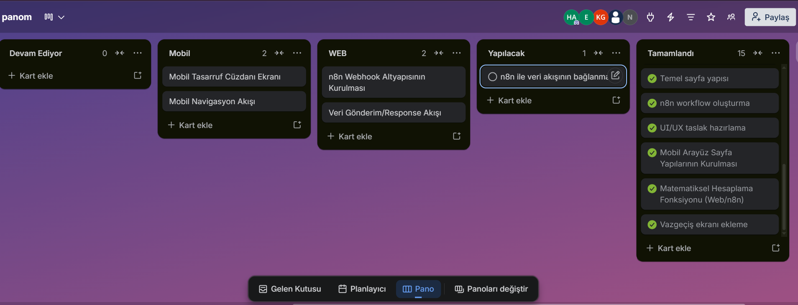
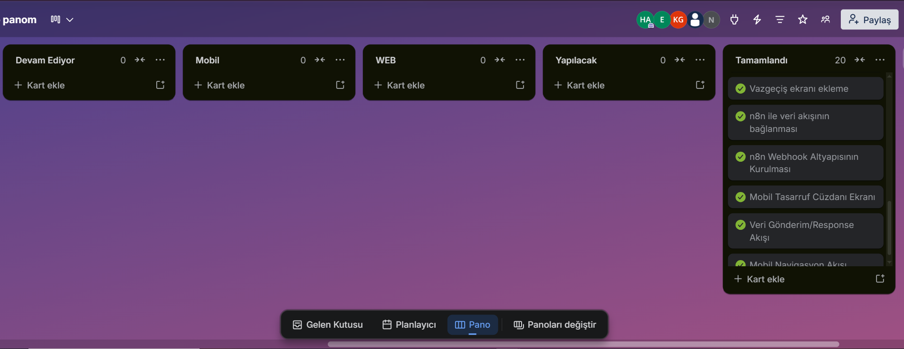
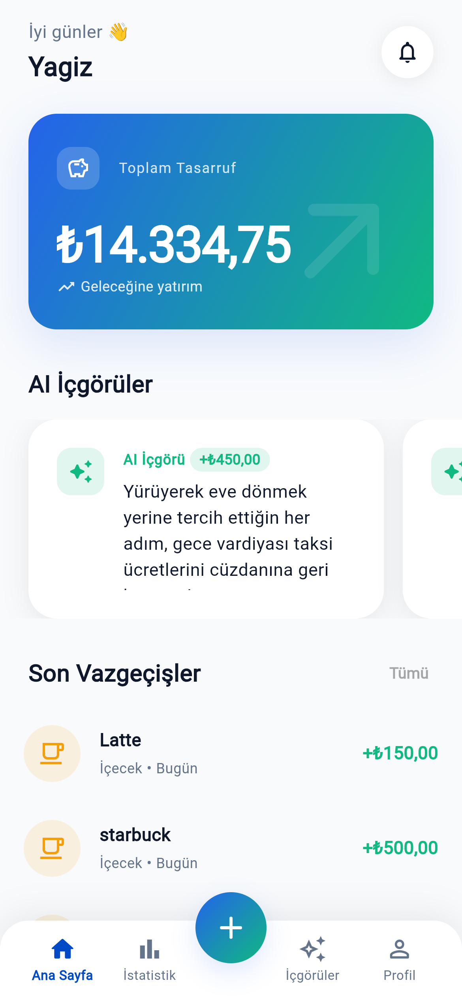
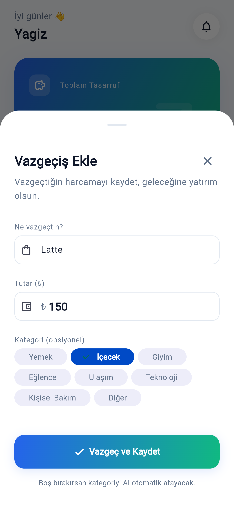
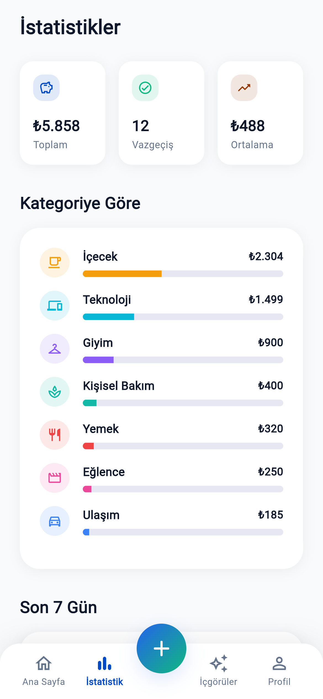

### *"Harcamadığın her kuruş, geleceğine yapılan bir yatırımdır."*

### 🚀 No-Code / Low-Code Bootcamp 2026

---

---

# 📖 Proje Hakkında

**Vazgeçtim**, kullanıcıların satın almaktan vazgeçtiği ürünleri veya gerçekleştirmemeyi tercih ettiği harcamaları kayıt altına alarak bunları görünür bir tasarrufa dönüştüren yapay zekâ destekli kişisel finans farkındalık uygulamasıdır.

Geleneksel bütçe uygulamaları yalnızca yapılan harcamaları takip ederken, **Vazgeçtim** kullanıcıların **yapmadığı harcamaları** başarıya dönüştürmeyi amaçlar.

Kullanıcılar;

- Satın almaktan vazgeçtikleri ürünleri,
- Gitmekten vazgeçtikleri etkinlikleri,
- Günlük hayatta yapmamayı tercih ettikleri harcamaları

uygulamaya ekleyerek bu kararların toplam parasal değerini **Tasarruf Cüzdanı** içerisinde biriktirebilirler.

İlerleyen sprintlerde entegre edilecek yapay zekâ desteği sayesinde kullanıcı davranışları analiz edilerek kişiselleştirilmiş finansal içgörüler sunulacaktır.

---

# 🎯 Proje Vizyonu

Bireylerin harcama alışkanlıklarını daha bilinçli hale getirmek, vazgeçilen harcamaları görünür kılarak tasarrufu motive eden yenilikçi ve oyunlaştırılmış bir finans deneyimi sunmak.

---

## Takım İsmi
StackOverthink

---

# 👥 Takım Üyeleri

| Rol | Üye |
|------|------|
| Scrum Master | Hüsna Altın |
| Product Owner | Elif İrem Akdoğan |
| Developer | Kaan Kerim Gödek |
| Developer | Tuana Nehir Baran |
| Developer | Yağız Ali Çolak |

---

# ✨ Ürün Özellikleri

- 🛒 Sanal Sepet Deneyimi
- 💰 Tasarruf Cüzdanı
- 📝 Günlük Vazgeçiş Kaydı
- 📊 Harcama Alışkanlığı Takibi
- 🤖 Yapay Zekâ Destekli Davranış Analizi 
- 📈 Haftalık / Aylık Kişiselleştirilmiş İçgörüler 
- 🔔 Motivasyon ve Başarı Bildirimleri 

---

# 🎯 Hedef Kitle

- Harcamalarını daha bilinçli yönetmek isteyen genç yetişkinler
- Üniversite öğrencileri
- Yeni mezunlar
- Dürtüsel alışveriş alışkanlığına sahip bireyler
- Kişisel finans farkındalığını artırmak isteyen herkes

---

# 📋 Product Backlog

Proje toplam **3 Sprint** olarak planlanmıştır.

| Sprint | Tema | Tarih Aralığı | Görev Sayısı |
|----------|----------------------|------------------|:---:|
| Sprint 1 | Temel Altyapı (Foundation) | 19 Haziran – 5 Temmuz | 9 |
| Sprint 2 | Yapay Zekâ Katmanı | 6 Temmuz – 19 Temmuz | 9 |
| Sprint 3 | Son Rötuşlar ve Teslim | 20 Temmuz – 2 Ağustos | 9 |

Toplam planlanan görev sayısı **27**'dir.

Backlog Dağıtım Mantığı
Görevler şu mantıkla 3 sprint'e bölündü:

•	Sprint 1 — Temel (Foundation): AI olmadan da çalışan bir iskelet ürün. Takım kimliği, tasarım, temel veri akışı ve cüzdan mantığı bu sprintte oturtulur. Amaç: Sprint 1 sonunda elle test edilebilir, uçtan uca (baştan sona) çalışan basit bir prototip olması.

•	Sprint 2 — Akıllı Katman (Intelligence): Yapay zeka entegrasyonu bu sprintte gelir: kategori sınıflandırma, davranış analizi, doğal dilde içgörü üretimi. Amaç: Final değerlendirmedeki 35 puanlık "Yapay Zeka Öğeleri" kriterinin temelini bu sprintte sağlamlaştırmak.

•	Sprint 3 — Cilalama ve Teslim (Polish & Delivery): UI/UX iyileştirme, hataların giderilmesi, kullanıcı testi, video ve son teslim dokümantasyonu. Amaç: "Ürün bütünlüğü" ve "Fonksiyonel yeterlilik" kriterlerini maksimize etmek.

---
# 🚀 Sprint 1

## 🎯 Sprint Amacı

Sprint 1'in temel amacı, yapay zekâ entegrasyonu bulunmayan ancak uçtan uca çalışabilen bir temel ürün (MVP) oluşturmaktır.

Sprint sonunda;

- Temel kullanıcı akışı oluşturulmuş,
- Arayüz tasarımları hazırlanmış,
- Kullanıcının vazgeçiş kaydı oluşturabileceği form geliştirilmiş,
- n8n veri akışı kurulmuş,
- Tasarruf Cüzdanı çalışır duruma getirilmiş olacaktır.

---

- **Daily Scrum**: Görüşmeler Slack üzerinden yapılmış yazışmalar Whatsapp ve Slack üzerinden  sağlanmıştır. .
  
### 📱 Daily Scrum - WhatsApp Yazışmaları

|  |  |

- **SİLİNECEKTasarım ve Developing Mantığı**: Tasarım tarafı aynı zamanda developing kısmında da çalışacaktır. 1. ve 2. Sprint'te tasarım dilinin tam oturması için ayrı grup oluşturulması takımca doğru bulunmuştur.

- **Sprint 1 board update**: Sprint Board Screenshot:
  
|  |  |  |

**Ürün Durumu**: Ekran Görüntüleri:  

| Ana Sayfa | Vazgeçiş Ekle | İstatistikler |
|-----------|---------------|---------------|
|  |  |  |

  **Sprint Review**:
Sprint 1'in temel hedefi, yapay zeka entegrasyonu olmadan uçtan uca çalışan bir iskelet prototip ortaya çıkarmaktı.
Tamamlanan:
- Takım kimliği ve GitHub repo kurulumu
- Kullanıcı akışı (user flow) ve wireframe tasarımı
- Vazgeçiş ekleme formu geliştirildi
- Tasarruf Cüzdanı temel mantığı kuruldu
- n8n webhook + Google Sheets veri akışı bağlandı
- Mobil ve web arayüz tasarımları tamamlandı

Bir sonraki sprinte devreden:
- Mobil ve web arayüzlerinin detaylandırılması

Genel değerlendirme: Sprint hedefinin büyük bölümü başarıyla tamamlandı, devreden görevler Sprint 2'nin ilk günlerinde kapatılacak.

  **Sprint Retrospective:**
- Teknik altyapı sorunsuz kuruldu, n8n ve Google Sheets entegrasyonu başarıyla tamamlandı
- Sprint hedefinin büyük bölümü zamanında teslim edildi
- Scrum rollerinin işlevselliği ekip çalışmasına olumlu katkı sağladı
- Daily Scrum'ların daha düzenli aralıklarla yapılması hedefleniyor
- Trello üzerindeki görev takibinin daha aktif kullanılması planlanıyor

